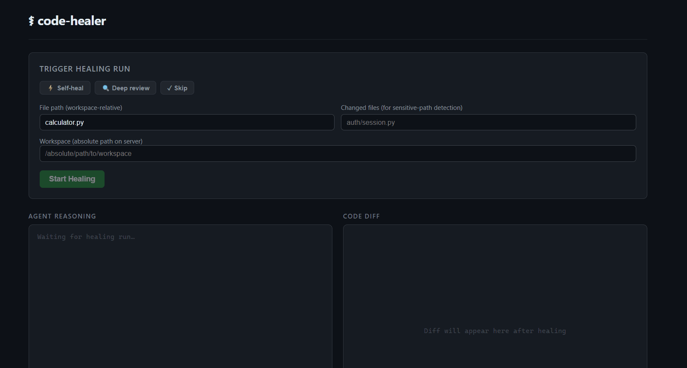

# code-healer

An autonomous "gatekeeper" agent for code repositories. When tests fail — or when a
change touches a sensitive path — code-healer intercepts it, reasons over the failure
in an isolated Docker sandbox, rewrites the faulty code, re-runs the tests to verify
the fix, and pushes the repaired code back onto a new branch. All of this is streamed
live to a dashboard so you can watch the agent think, run tools, and iterate.



## How it works

**1. Trigger** — a healing run starts either from the dashboard form (simulating a CI
failure) or from a real CI webhook (`POST /webhook/github`, HMAC-signed like GitHub's
own webhooks).

**2. Pre-check gate** — before any LLM call, the backend runs `pytest` and `ruff`
against the workspace on the host. This decides what happens next:

| Outcome | Trigger | Cost |
|---|---|---|
| **Self-heal** | pytest/ruff fails locally | Agent activates to fix the failure |
| **Deep review** | Tests pass, but the diff touches a sensitive path (`auth/`, `payments/`, `db/queries/` — configurable) | Agent performs a semantic review even on a green build |
| **Skipped** | Tests pass and no sensitive path is touched | No LLM call — zero cost |

**3. Agent loop** — for activated runs, an agent built directly on the Anthropic Python
SDK (no framework) gets tool access to the workspace: `read_file`, `write_file`,
`list_files`, `run_tests`, `run_linter`. Test and lint execution happen inside ephemeral
Docker containers, never on the host, so the agent can never touch anything outside the
sandbox. The agent iterates — read, edit, test, observe, repeat — until the suite passes
or it hits the configured iteration limit.

**4. Push-back** — once tests pass, the fix is committed to a new local branch
(`fix/code-healer-<run-id>`), and the working tree is restored to the base branch so the
next run starts clean.

**5. Live dashboard** — every reasoning step, tool call, and test result streams over a
WebSocket to a React dashboard, with a before/after diff view and a run history table
backed by SQLite.

## Project layout

```
code-healer/
├── backend/        FastAPI app — routes, WebSocket, pre-check gate, activation logic, DB
├── agent/          Agent loop (Anthropic SDK), tool implementations, Docker sandbox manager
├── frontend/       React + Vite dashboard
├── sandbox-image/  Docker image the agent's tools run inside (Python + pytest + ruff)
├── demo/           Sample broken/clean repos used by the demo scripts and dashboard presets
├── tests/          Unit tests for the pre-check gate, activation logic, and config loader
└── config.yaml     Model name, iteration limit, sensitive paths
```

## Requirements

- Python 3.12
- Node.js 18+
- Docker Desktop (running) — the sandbox image is built from it and the backend spawns
  containers via the Docker socket
- An Anthropic API key (uses API credits, billed separately from a Claude subscription)

## Setup

```bash
git clone <this-repo>
cd code-healer

cp .env.example .env
# edit .env and set ANTHROPIC_API_KEY

pip install -r backend/requirements.txt
cd frontend && npm install && cd ..

docker build -t code-healer-sandbox ./sandbox-image
```

## Running locally

**Windows:**

```powershell
.\start.ps1
```

**macOS/Linux:**

```bash
./start.sh
```

Or run the two halves manually:

```bash
# Terminal 1 — backend
uvicorn backend.main:app --port 8000

# Terminal 2 — frontend
cd frontend && npm run dev
```

Dashboard: http://localhost:5173 (API is proxied to `http://localhost:8000`)

> Don't add `--reload` for demo runs — the agent's own `write_file` tool edits files
> under `demo/`, and a naive file-watcher reload mid-run will drop the WebSocket and
> freeze the live log feed even though the run finishes in the background. If you're
> actively editing backend/agent code, scope the watcher instead:
> `uvicorn backend.main:app --reload --reload-dir backend --reload-dir agent --port 8000`
> (or `.\start.ps1 -Dev`).

## Demo scripts

`demo/run_demo.ps1` / `demo/run_demo.sh` check your prerequisites (`.env`, Docker,
sandbox image, backend/frontend up) and reset the demo workspace, then walk you through
triggering a run from the dashboard.

```powershell
.\demo\run_demo.ps1            # Scenario A — self-heal (calculator.py bug)
.\demo\run_demo.ps1 -Scenario B  # Scenario B — deep review (auth/session.py)
.\demo\run_demo.ps1 -Scenario C  # Scenario C — green build, run skipped
```

## Configuration

`config.yaml` (repo root):

```yaml
model: claude-sonnet-4-6
max_iterations: 20      # max agent/API round-trips per run
sensitive_paths:        # triggers Scenario B even on a green build
  - auth/
  - payments/
  - db/queries/
```

`.env` (see `.env.example`):

| Variable | Purpose |
|---|---|
| `ANTHROPIC_API_KEY` | Required — used for all agent LLM calls |
| `TRIGGER_API_KEY` | Optional — guards `POST /trigger`; leave unset for local dev |
| `GITHUB_WEBHOOK_SECRET` | Required to enable `POST /webhook/github` |
| `HOST_PROJECT_ROOT` | Docker Compose only — host-absolute repo path, needed so sandbox containers mount the right workspace |

## Running with Docker Compose

```bash
cp .env.example .env   # fill in ANTHROPIC_API_KEY, HOST_PROJECT_ROOT, etc.
docker compose up --build
```

This builds and runs the backend and frontend containers. The backend mounts the host's
Docker socket so it can still spawn ephemeral sandbox containers for test/lint runs.

## Tests

```bash
pytest
```

Covers the pre-check gate, activation logic (self-heal / deep review / skip), and
config loading.

## Tech stack

| Layer | Tech |
|---|---|
| Backend | Python 3.12, FastAPI, WebSockets, SQLAlchemy + SQLite |
| Agent | Anthropic Python SDK (native tool use) |
| Sandbox | Docker, ephemeral per-run containers |
| Frontend | React, Vite |
| Config | `config.yaml` + `.env` |
